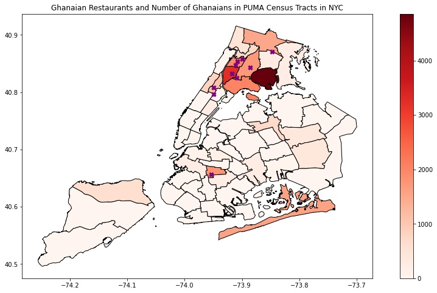

# Minority Restaurants in NYC

## Description
This project is addressing the question: __Are ethnic groups in the U.S. repsented in proportion to their actual population?__ More specifically, are ethnic neighborhoods represented equally in proportion to how many people of that group live there?

To answer this question, **I examine the number of eateries per person for 3 groups in New York City: the _Garifuna_, _Uyghurs_, and the _Ghanaian peoples_**. To do this, I scraped yelp to find the number and location of eateries that represent each of these groups. Further, in the case of the Ghanaian peoples, I was able to correlate the true number of Ghanaians in districts in NYC with the number of eateries in those areas. 

## Findings
I found that Uyghurs were vastly over-represented in NYC compared to the other groups and that the Garifuna are vastly under-represented. At least in the case of the Ghanian peoples, it's clear that there is a high correlation between where Ghanaians live and where Ghanaian eateries are located.

The reasons for the differences in representation between the groups are complex and anecdotal, at this stage. Some suggestions for anyone digging deeper into this question include: year of main "wave" of arrivals, prior notability of the group in the U.S., whether the group has political representation in their home country, and similarity to already established groups. 

## Further Reading
This project is expanded on in the following formats:

**[Application](https://minority-restaurants-in-nyc.herokuapp.com)** 

Here, you can view the data for each group yourself. There is also more information about each of the groups and a heat map showing (hypothesized) hotspots for each group in NYC. 

**Blog post** 
- [Part 1](https://medium.com/@gregfeliu/are-ethnic-restaurants-in-ethnic-neighborhoods-part-1-f0eccc394ff7)
- [Part 2](https://medium.com/@gregfeliu/are-ethnic-restaurants-in-ethnic-neighborhoods-part-2-ddbac417452a)

Here, you can dive deeper into the motivations for this project and the larger discussion that it engages in.

## Technologies Used
- Jupyter Notebook
- Python
    - Matplotlib
    - Pandas 
    - Geopandas 
    - Shapely 
- Streamlit / Heroku
